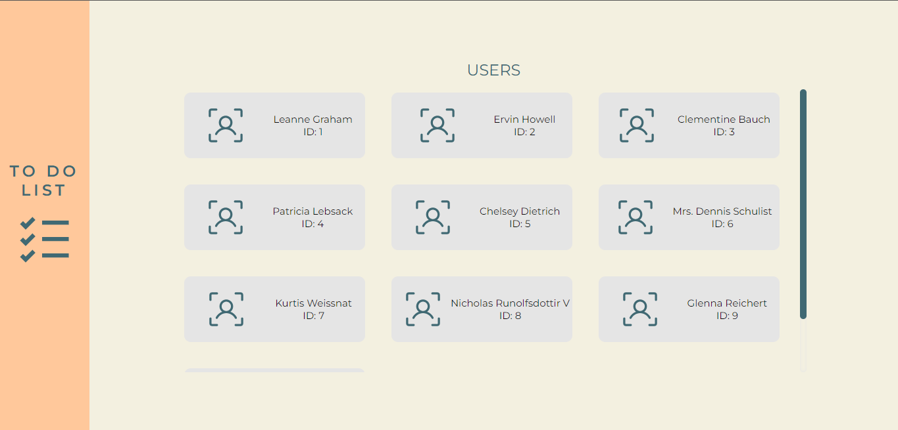

# <a href="https://harmonious-cendol-c8e926.netlify.app/">🔗 To Do List APP</a>

### Status do projeto: 
<h4 align="center"> ✅ Concluído </h4>

---

## 🗂️ Índice
<!--ts-->
   * [Sobre o projeto](#💻-sobre-o-projeto)
   * [Funcionalidades](#⚙️-funcionalidades)
   * [Tecnologias](#🔧-tecnologias-utilizadas)
   * [Layout](#🎨-layout)
   * [Deploy](#💻-deploy)
   * [Desenvolvido](#👽-autora)
<!--te-->

---

## 💻 Sobre o projeto 

Aplicação de ToDo List desenvolvida em React.JS a partir da API {JSON} Placeholder. Nela é possível visualizar a lista de usuários e as tarefas de cada um.

---

## ⚙️ Funcionalidades
- Visualizar todos os usuários;
- Visualizar tarefas de cada usuário;
- Inserir novas tarefas;
- Marcar uma terefa como pendente ou concluída. 

---

## 🔧 Tecnologias utilizadas

- <a href="https://pt-br.reactjs.org/"> React </a>
- <a href="https://www.javascript.com/"> JavaScript </a>
- <a href="https://axios-http.com/ptbr/docs/intro"> Axios </a>

---

## 🎨 Layout

 Protótipo da aplicação disponível em: 

 

---

## 💻 Deploy 

---
## 👽 Desenvolvido por

<a href="https://github.com/vanessacreis">
 
  
 <b>Vanessa Reis 🚀</b></a> 
 
Desenvolvedora web front-end. Estudante de Desenvolvimento Web Full Stack pela Resilia Educação.

 